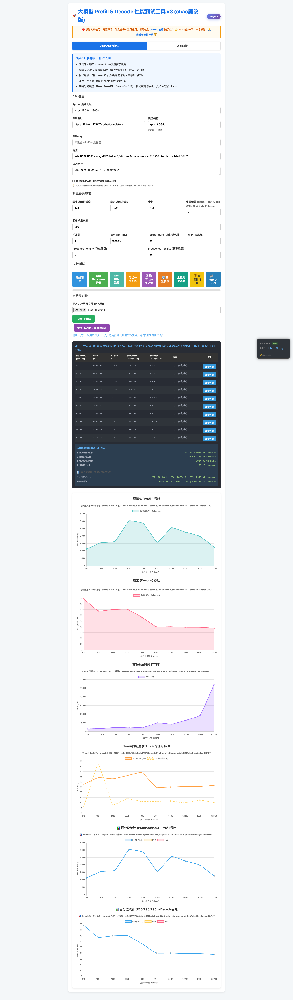

# Context-Aware Adaptive MTP Scheduling

> 从 fixed-512 局部峰值到一次加载覆盖 512→32K 的完整性能包络

## 摘要

我们在 Hygon K100AI 上优化 Qwen3.6-35B-A3B W8A8 时，早期一直用 fixed-512 / 固定 MTP3 作为主要仲裁口径，并把 106–107 tok/s 的短上下文结果作为单卡峰值。扩大到 512→32K 的完整 token-length 曲线后，我们发现：**固定 speculative depth 只在局部区间最优，长上下文继续维持 MTP3 会让 draft + verify 的额外成本超过收益。**

因此我们把问题从“找一个最优 MTP 参数”改写为“对上下文长度做 profile，找到 speculation 的收益交叉点，并在同一个服务实例内部自动切换”。R389 的公开策略是：

- `< 6144 computed tokens`：Qwen 原生 MTP3；
- `>= 6144 computed tokens`：停止 drafter，并清除后续 speculative placeholders，使 target 回到真正的单 token decode；
- target `max_model_len` 仍为 262144；
- 不重启、不重新加载权重、不由外部脚本中途修改参数。

在单卡、单并发、输出 256 token 的 10 点浏览器验收中，R389 的 Decode 曲线为：

`88.33 → 67.31 → 69.81 → 70.27 → 56.66 → 40.08 → 40.03 → 39.19 → 39.11 → 37.68 tok/s`

对应 prompt 长度：

`512, 1024, 2048, 3072, 4096, 6144, 8192, 12288, 16384, 32768`

这条曲线体现了我们真正想要的部署行为：短上下文吃到 MTP 的高收益，跨过 crossover 后不再为无收益的 speculative work 付费，长上下文进入约 40→38 tok/s 的平稳平台。

---

## 1. 问题是怎么暴露出来的

### 阶段 A：先把短 Decode 做快

前 200+ 轮实验主要解决 K100AI 上真实小 M shape 的问题：W8A8 Linear、INT8 `lm_head`、GDN 融合、MoE tile、runtime 同步、GPU-side speculative metadata 等。R269 把 fixed-512 MTP3 推到约 106–107 tok/s，这个结果本身仍然有效。

但它回答的是：

> 在这个短上下文 workload 上，固定 MTP3 能跑多快？

它没有回答：

> 一个长期部署、一次加载的服务，从 512 到 32K 是否仍然应该一直使用 MTP3？

### 阶段 B：把 benchmark 变成完整曲线

当验收改成 512→32K 多点曲线后，固定 MTP 的局限变得明显：随着上下文增长，MTP draft、verification、KV/attention 相关开销占比变化，短上下文的冠军配置不再等于长上下文冠军配置。

这说明历史版本的主要缺陷不是“106–107 tok/s 是假数据”，而是**用局部峰值代表完整部署最优**。

### 阶段 C：把参数问题改造成调度问题

我们随后测试了不同 cutoff，并确认需要同时处理两个层面：

1. **Runner 层**：让 drafter 在 cutoff 后真的停止，而不是继续把 target 的 262K `max_model_len` 当成 drafter 上限；
2. **Scheduler 层**：cutoff 后不能继续给下一步塞固定数量的 speculative placeholders，否则 target 仍然会按 M=4 verification 路径执行，名义上“停了 drafter”，实际上没有回到真正 M=1。

R304 + R305 分别解决这两个问题。

---

## 2. R389：一次加载的两段式自适应策略

R389 不是运行中改 vLLM 启动参数，也不是跑到 6K 后重启容器。所有策略在启动时一次性加载：

```text
context < 6144
    -> MTP3 draft + target verify

context >= 6144
    -> drafter skipped
    -> future speculative placeholders cleared
    -> normal target single-token decode
```

实现文件：

```text
patches/r389_adaptive_mtp/r304_force_drafter_cutoff.py
patches/r389_adaptive_mtp/r305_adaptive_scheduler.py
scripts/serve_r389_adaptive_mtp.sh
```

默认 cutoff 是我们当前 K100AI + Qwen3.6-35B-A3B W8A8 profile 得到的 6144。它是**硬件、模型、runtime 和 workload 相关参数**，不应被当作跨平台常数。

---

## 3. 实测性能包络

环境：Hygon K100AI / gfx928，TP=1，单并发，vLLM 0.18.1 / DTK 26.04，Prefix Cache 开启，target `max_model_len=262144`。

| Prompt tokens | Decode tok/s | 调度状态 |
|---:|---:|---|
| 512 | **88.33** | MTP3 |
| 1,024 | **67.31** | MTP3 |
| 2,048 | **69.81** | MTP3 |
| 3,072 | **70.27** | MTP3 |
| 4,096 | **56.66** | MTP3 |
| 6,144 | **40.08** | cutoff / no-MTP |
| 8,192 | **40.03** | no-MTP |
| 12,288 | **39.19** | no-MTP |
| 16,384 | **39.11** | no-MTP |
| 32,768 | **37.68** | no-MTP |

10 点平均 Decode：**53.29 tok/s**。

完整网页截图：



注意：R269 的 106–107 tok/s fixed-512 仍是有效的**短上下文局部峰值**，但它不再作为本仓库默认部署方案。R389 的目标不同：最大化一次加载后从短到长上下文的整体可用性和性能包络。

---

## 4. 正确性与安全边界

R389 不是只做速度测试。当前验收包括：

- exact string：PASS；
- `137*29 -> 3973`：PASS；
- code extraction `Q7ZK-4815`：PASS；
- 同一确定性技术 prompt 连续 3 次输出 SHA256 完全一致：PASS；
- 约 32K natural needle retrieval，3 个独立 secret：3/3 PASS。

此外，历史 R237 的 multimodal direct-embedding 快路径后来在 arbitrary-length chunked-prefill tail 上发现语义风险，因此 R389 **默认显式设置 `K100_R237_MM_DIRECT_EMBED=0`**。这与“固定 MTP 的局部最优问题”是两个不同问题，但都在本次默认发布入口中一起修正。

当前公开 R389 的完整性能验收范围是 **512→32K**。虽然 target `max_model_len` 保持 262144，但在完成同口径 257901-token gate 前，我们不把 R389 宣称为 262K 全范围冠军。

---

## 5. 与已有动态 speculative decoding 的关系

“固定 speculative length 不是全局最优”并不是一个孤立发现。DISCO（Mamou et al., 2024）和 SpecDec++（Huang et al., 2024）都研究了运行时自适应 candidate/speculation length；较新的 vLLM 也已经支持按 batch-size 区间选择不同 speculative token 数，甚至在高负载区间选择 `K=0`。

我们的工程实践与这些工作方向一致，但控制信号不同：本项目当前首先使用**上下文长度 profile** 来决定何时让 MTP 退出，因为 K100AI + Qwen3.6 的完整 token-length 曲线清晰暴露了 crossover。

因此更准确的名称是：

**Profile-Guided Context-Aware Adaptive MTP Scheduling**  
**基于性能画像的上下文感知自适应 MTP 调度**

我们不主张这是“动态 speculative decoding”这一大类思想的首次提出；本项目的贡献是把它落实到指定国产加速卡 + 指定原生 MTP 模型 + 指定 runtime 上，并给出可复现的 cutoff patch、完整曲线和质量门禁。

参考：

1. Mamou et al., *Dynamic Speculation Lookahead Accelerates Speculative Decoding of Large Language Models*, arXiv:2405.04304 / PMLR 2024.
2. Huang et al., *SpecDec++: Boosting Speculative Decoding via Adaptive Candidate Lengths*, arXiv:2405.19715, 2024.
3. vLLM, *Dynamic Speculative Decoding* documentation (dynamic `K` by batch-size ranges, including `K=0`).

---

## 6. 下一步

现在的 R389 是最简单、最稳的两段式策略：

`MTP3 -> no-MTP`

更完整的研究方向是对每个上下文区间分别 profile `MTP4/MTP3/MTP2/MTP1/no-MTP`，取各点的性能上包络，再把 batch size、acceptance rate 和资源压力加入调度输入。最终目标不是手工选择一个固定 MTP 深度，而是让服务自动逼近：

```text
best_policy = argmax throughput(context, batch, acceptance, hardware)
```

这也是本项目从“单点 kernel 调优”走向“运行时策略优化”的下一阶段。
